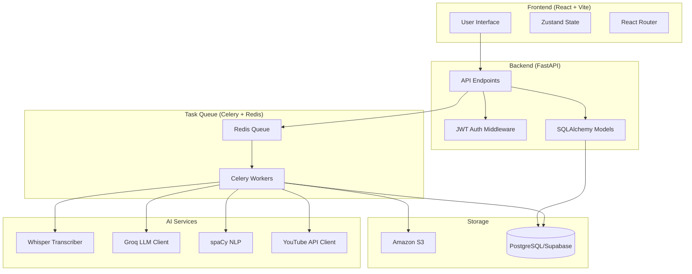

# Design Document: LectureIQ

## Overview

LectureIQ is a full-stack web application that transforms lecture audio recordings into comprehensive learning systems. The platform consists of a React-based frontend, a FastAPI backend with asynchronous task processing, and multiple AI/ML components for transcription, content generation, and resource discovery.

### Architecture Philosophy

The system follows a microservices-inspired architecture with clear separation of concerns:
- **Frontend**: Handles user interactions and real-time status updates
- **API Layer**: Manages HTTP requests, authentication, and business logic
- **Task Queue**: Processes long-running AI operations asynchronously
- **Storage Layer**: Manages file storage and database operations
- **AI Services**: Encapsulates all ML/AI processing logic

### Key Design Decisions

1. **Asynchronous Processing**: Use Celery + Redis for background jobs to prevent blocking user interactions
2. **Local Whisper**: Run Whisper locally to avoid transcription API costs
3. **Groq API**: Use free Groq API (Llama 3.1 70B) for LLM inference instead of paid OpenAI API
4. **S3 for Audio Only**: Store only audio files in S3; keep generated content in PostgreSQL for faster access
5. **JWT Authentication**: Stateless authentication for scalability
6. **Real-time Updates**: WebSocket or polling for processing status updates

## Architecture

### System Components



### Data Flow

1. **Upload Flow**: User uploads audio → API validates → Store in S3 → Create lecture record → Queue transcription job
2. **Processing Flow**: Worker fetches audio → Whisper transcribes → Extract topics → Generate materials (LLM) → Find resources → Store results
3. **Retrieval Flow**: User requests materials → API fetches from DB → Return JSON → Frontend renders

### Technology Stack Rationale

- **FastAPI**: High performance, async support, automatic OpenAPI docs, type hints
- **Celery**: Mature task queue with retry logic, monitoring, and scheduling
- **PostgreSQL**: Relational data with JSONB support for flexible schema
- **React 18**: Modern UI with concurrent rendering and suspense
- **Zustand**: Lightweight state management without Redux boilerplate
- **Whisper Base**: Balance between accuracy and speed for local processing
- **Groq API**: Free tier with fast inference (300+ tokens/sec)

## Components and Interfaces

### Frontend Components

#### 1. Upload Component
```typescript
interface UploadComponentProps {
  onUploadComplete: (lectureId: string) => void;
}

interface UploadState {
  file: File | null;
  progress: number;
  error: string | null;
}

// Handles drag-and-drop, file validation, progress tracking
// Validates: file type (MP3/WAV/M4A), size (<100MB)
// Calls: POST /api/lectures/upload
```

#### 2. Dashboard Component
```typescript
interface Lecture {
  id: string;
  title: string;
  uploadedAt: string;
  status: 'uploading' | 'processing' | 'completed' | 'failed';
  duration: number;
  progress?: number;
}

interface DashboardState {
  lectures: Lecture[];
  loading: boolean;
  error: string | null;
}

// Displays lecture list with status
// Polls: GET /api/lectures for status updates every 5 seconds
// Navigates to lecture detail on click
```

#### 3. Lecture Detail Component
```typescript
interface LectureDetail {
  id: string;
  title: string;
  transcript: TranscriptSegment[];
  notes: string; // Markdown
  flashcards: Flashcard[];
  mcqs: MCQ[];
  resources: Resource[];
}

interface TranscriptSegment {
  start: number;
  end: number;
  text: string;
}

interface Flashcard {
  id: string;
  question: string;
  answer: string;
  difficulty?: 'easy' | 'medium' | 'hard';
}

interface MCQ {
  id: string;
  question: string;
  options: string[];
  correctIndex: number;
  explanation: string;
}

interface Resource {
  type: 'youtube' | 'documentation' | 'practice';
  title: string;
  url: string;
  relevance: number;
}

// Displays all study materials
// Tabs: Transcript, Notes, Flashcards, Quiz, Resources
// Calls: GET /api/lectures/{id}
```

#### 4. Flashcard Review Component
```typescript
interface FlashcardReviewState {
  currentIndex: number;
  showAnswer: boolean;
  cards: Flashcard[];
  reviewHistory: ReviewRecord[];
}

interface ReviewRecord {
  cardId: string;
  timestamp: string;
  difficulty: 'easy' | 'medium' | 'hard';
}

// Implements spaced repetition algorithm
// Tracks user performance
// Calls: POST /api/lectures/{id}/flashcards/review
```

#### 5. Quiz Component
```typescript
interface QuizState {
  currentQuestion: number;
  answers: (number | null)[];
  score: number | null;
  showResults: boolean;
}

// Interactive MCQ quiz
// Instant feedback on submission
// Calls: POST /api/lectures/{id}/quiz/submit
```

### Backend API Endpoints

#### Authentication Endpoints

```python
POST /api/auth/register
Request: { email: str, password: str, name: str }
Response: { user_id: str, token: str }

POST /api/auth/login
Request: { email: str, password: str }
Response: { token: str, user: UserProfile }

POST /api/auth/logout
Headers: { Authorization: "Bearer <token>" }
Response: { message: str }
```

#### Lecture Endpoints

```python
POST /api/lectures/upload
Headers: { Authorization: "Bearer <token>" }
Body: multipart/form-data { file: File, title?: str }
Response: { lecture_id: str, status: str }

GET /api/lectures
Headers: { Authorization: "Bearer <token>" }
Query: { page: int, limit: int }
Response: { lectures: Lecture[], total: int }

GET /api/lectures/{lecture_id}
Headers: { Authorization: "Bearer <token>" }
Response: LectureDetail

DELETE /api/lectures/{lecture_id}
Headers: { Authorization: "Bearer <token>" }
Response: { message: str }

GET /api/lectures/{lecture_id}/status
Headers: { Authorization: "Bearer <token>" }
Response: { status: str, progress: int, error?: str }

GET /api/lectures/{lecture_id}/download
Headers: { Authorization: "Bearer <token>" }
Response: PDF file (application/pdf)
```

#### Study Tool Endpoints

```python
POST /api/lectures/{lecture_id}/flashcards/review
Headers: { Authorization: "Bearer <token>" }
Body: { card_id: str, difficulty: str }
Response: { next_review: str }

POST /api/lectures/{lecture_id}/quiz/submit
Headers: { Authorization: "Bearer <token>" }
Body: { answers: int[] }
Response: { score: int, total: int, details: QuizResult[] }

POST /api/lectures/summary
Headers: { Authorization: "Bearer <token>" }
Body: { lecture_ids: str[] }
Response: { summary: str, topics: str[] }
```

#### Analytics Endpoints

```python
GET /api/analytics/progress
Headers: { Authorization: "Bearer <token>" }
Response: { 
  total_lectures: int,
  completed_reviews: int,
  average_quiz_score: float,
  weak_topics: str[]
}
```

### Backend Services

#### 1. Audio Processor Service

```python
class AudioProcessorService:
    def __init__(self, whisper_model: str = "base"):
        self.model = whisper.load_model(whisper_model)
    
    def transcribe(self, audio_path: str) -> Transcript:
        """
        Transcribes audio file using Whisper.
        
        Args:
            audio_path: Path to audio file in S3 or local storage
            
        Returns:
            Transcript with timestamped segments
            
        Raises:
            TranscriptionError: If transcription fails
        """
        # Download from S3 if needed
        # Run Whisper transcription
        # Parse output into segments with timestamps
        # Return structured transcript
        pass
    
    def detect_language(self, audio_path: str) -> str:
        """Detects primary language (hi/en/mixed)"""
        pass
```

#### 2. Content Generator Service

```python
class ContentGeneratorService:
    def __init__(self, groq_api_key: str):
        self.client = Groq(api_key=groq_api_key)
        self.model = "llama-3.1-70b-versatile"
    
    def generate_notes(self, transcript: str) -> str:
        """
        Generates structured markdown notes from transcript.
        
        Prompt engineering:
        - Extract key concepts, definitions, theorems
        - Organize with headers and bullet points
        - Format formulas in LaTeX/markdown math
        - Maintain logical flow
        
        Returns:
            Markdown-formatted notes
        """
        pass
    
    def generate_flashcards(self, transcript: str, count: int = 12) -> list[Flashcard]:
        """
        Generates flashcards from transcript.
        
        Prompt engineering:
        - Create Q&A pairs covering key concepts
        - Ensure questions are clear and specific
        - Answers should be concise but complete
        - Target 10-15 cards per lecture
        
        Returns:
            List of flashcard objects
        """
        pass
    
    def generate_mcqs(self, transcript: str, count: int = 8) -> list[MCQ]:
        """
        Generates multiple-choice questions.
        
        Prompt engineering:
        - Create questions testing understanding
        - 4 options per question
        - One correct answer
        - Detailed explanations for correct answer
        - Target 5-10 MCQs per lecture
        
        Returns:
            List of MCQ objects
        """
        pass
    
    def extract_key_concepts(self, transcript: str) -> list[str]:
        """
        Extracts main topics and concepts.
        
        Used for resource linking.
        Returns list of topic strings.
        """
        pass
    
    def generate_summary(self, transcripts: list[str]) -> str:
        """
        Generates consolidated summary from multiple lectures.
        
        Prompt engineering:
        - Identify common themes
        - Organize by topic, not chronology
        - Highlight most important concepts
        - Include cross-references
        
        Returns:
            Markdown-formatted summary
        """
        pass
```

#### 3. Resource Linker Service

```python
class ResourceLinkerService:
    def __init__(self, youtube_api_key: str):
        self.youtube = build('youtube', 'v3', developerKey=youtube_api_key)
        self.nlp = spacy.load("en_core_web_sm")
    
    def extract_topics(self, text: str) -> list[str]:
        """
        Extracts topics using spaCy NLP.
        
        - Named entity recognition
        - Noun phrase extraction
        - Filter by relevance
        
        Returns:
            List of topic strings
        """
        pass
    
    def find_youtube_videos(self, topic: str, max_results: int = 3) -> list[Resource]:
        """
        Searches YouTube for tutorial videos.
        
        - Use YouTube Data API v3
        - Filter by relevance and view count
        - Prefer educational channels
        - Return top 3 results
        """
        pass
    
    def find_documentation(self, topic: str) -> list[Resource]:
        """
        Finds official documentation for programming topics.
        
        - Pattern matching for known technologies
        - Map to official doc URLs
        - Python → docs.python.org
        - JavaScript → developer.mozilla.org
        - etc.
        """
        pass
    
    def find_practice_problems(self, topic: str) -> list[Resource]:
        """
        Suggests practice problem sources.
        
        - Map topics to problem categories
        - Link to LeetCode, HackerRank, etc.
        - Filter by difficulty
        """
        pass
    
    def rank_resources(self, resources: list[Resource], topic: str) -> list[Resource]:
        """
        Ranks resources by relevance.
        
        - Title similarity to topic
        - Source credibility
        - Recency
        
        Returns top 3-5 resources
        """
        pass
```

#### 4. Storage Service

```python
class StorageService:
    def __init__(self, s3_client, bucket_name: str):
        self.s3 = s3_client
        self.bucket = bucket_name
    
    def upload_audio(self, file: UploadFile, lecture_id: str) -> str:
        """
        Uploads audio file to S3.
        
        - Generate unique key: lectures/{user_id}/{lecture_id}.{ext}
        - Enable server-side encryption
        - Set content type
        - Return S3 URL
        """
        pass
    
    def get_audio_url(self, lecture_id: str, expiry: int = 3600) -> str:
        """
        Generates presigned URL for audio access.
        
        - URL valid for 1 hour by default
        - Used by Celery workers to download audio
        """
        pass
    
    def delete_audio(self, lecture_id: str) -> bool:
        """Deletes audio file from S3"""
        pass
    
    def get_storage_usage(self, user_id: str) -> int:
        """Returns total storage used by user in bytes"""
        pass
```

#### 5. Authentication Service

```python
class AuthenticationService:
    def __init__(self, secret_key: str, algorithm: str = "HS256"):
        self.secret_key = secret_key
        self.algorithm = algorithm
    
    def hash_password(self, password: str) -> str:
        """Hashes password using bcrypt with cost factor 12"""
        pass
    
    def verify_password(self, password: str, hashed: str) -> bool:
        """Verifies password against hash"""
        pass
    
    def create_token(self, user_id: str, expiry_days: int = 7) -> str:
        """
        Creates JWT token.
        
        Payload:
        - user_id
        - exp (expiry timestamp)
        - iat (issued at timestamp)
        """
        pass
    
    def verify_token(self, token: str) -> str:
        """
        Verifies JWT token and returns user_id.
        
        Raises:
        - TokenExpiredError
        - InvalidTokenError
        """
        pass
```

### Celery Tasks

```python
@celery.task(bind=True, max_retries=3)
def process_lecture_task(self, lecture_id: str):
    """
    Main task for processing a lecture.
    
    Steps:
    1. Update status to 'processing'
    2. Download audio from S3
    3. Transcribe with Whisper
    4. Extract topics with NLP
    5. Generate notes, flashcards, MCQs with LLM
    6. Find resources with YouTube API
    7. Store all results in database
    8. Update status to 'completed'
    
    On error:
    - Retry up to 3 times with exponential backoff
    - If all retries fail, mark as 'failed'
    - Log detailed error information
    """
    try:
        # Implementation
        pass
    except Exception as exc:
        self.retry(exc=exc, countdown=60 * (2 ** self.request.retries))

@celery.task
def generate_summary_task(lecture_ids: list[str], user_id: str) -> str:
    """
    Generates consolidated summary from multiple lectures.
    
    - Fetch transcripts for all lectures
    - Call Content Generator
    - Return summary
    """
    pass

@celery.task
def cleanup_old_files_task():
    """
    Periodic task to clean up old files.
    
    - Run daily
    - Delete audio files older than 30 days
    - Delete failed processing jobs older than 7 days
    """
    pass
```

## Data Models

### Database Schema

```python
from sqlalchemy import Column, String, Integer, Float, DateTime, Text, JSON, ForeignKey, Enum
from sqlalchemy.orm import relationship
import enum

class ProcessingStatus(enum.Enum):
    UPLOADING = "uploading"
    PROCESSING = "processing"
    COMPLETED = "completed"
    FAILED = "failed"

class User(Base):
    __tablename__ = "users"
    
    id = Column(String, primary_key=True)
    email = Column(String, unique=True, nullable=False, index=True)
    password_hash = Column(String, nullable=False)
    name = Column(String, nullable=False)
    created_at = Column(DateTime, nullable=False)
    
    lectures = relationship("Lecture", back_populates="user", cascade="all, delete-orphan")
    quiz_attempts = relationship("QuizAttempt", back_populates="user")
    flashcard_reviews = relationship("FlashcardReview", back_populates="user")

class Lecture(Base):
    __tablename__ = "lectures"
    
    id = Column(String, primary_key=True)
    user_id = Column(String, ForeignKey("users.id"), nullable=False, index=True)
    title = Column(String, nullable=False)
    s3_key = Column(String, nullable=False)  # S3 object key
    duration = Column(Integer)  # Duration in seconds
    status = Column(Enum(ProcessingStatus), nullable=False, default=ProcessingStatus.UPLOADING)
    progress = Column(Integer, default=0)  # 0-100
    error_message = Column(Text)
    uploaded_at = Column(DateTime, nullable=False)
    processed_at = Column(DateTime)
    
    user = relationship("User", back_populates="lectures")
    transcript = relationship("Transcript", back_populates="lecture", uselist=False, cascade="all, delete-orphan")
    notes = relationship("Notes", back_populates="lecture", uselist=False, cascade="all, delete-orphan")
    flashcards = relationship("Flashcard", back_populates="lecture", cascade="all, delete-orphan")
    mcqs = relationship("MCQ", back_populates="lecture", cascade="all, delete-orphan")
    resources = relationship("Resource", back_populates="lecture", cascade="all, delete-orphan")

class Transcript(Base):
    __tablename__ = "transcripts"
    
    id = Column(String, primary_key=True)
    lecture_id = Column(String, ForeignKey("lectures.id"), nullable=False, unique=True)
    segments = Column(JSON, nullable=False)  # Array of {start, end, text}
    language = Column(String)  # Detected language
    created_at = Column(DateTime, nullable=False)
    
    lecture = relationship("Lecture", back_populates="transcript")

class Notes(Base):
    __tablename__ = "notes"
    
    id = Column(String, primary_key=True)
    lecture_id = Column(String, ForeignKey("lectures.id"), nullable=False, unique=True)
    content = Column(Text, nullable=False)  # Markdown content
    key_concepts = Column(JSON)  # Array of concept strings
    created_at = Column(DateTime, nullable=False)
    
    lecture = relationship("Lecture", back_populates="notes")

class Flashcard(Base):
    __tablename__ = "flashcards"
    
    id = Column(String, primary_key=True)
    lecture_id = Column(String, ForeignKey("lectures.id"), nullable=False, index=True)
    question = Column(Text, nullable=False)
    answer = Column(Text, nullable=False)
    order = Column(Integer, nullable=False)  # Display order
    created_at = Column(DateTime, nullable=False)
    
    lecture = relationship("Lecture", back_populates="flashcards")
    reviews = relationship("FlashcardReview", back_populates="flashcard")

class MCQ(Base):
    __tablename__ = "mcqs"
    
    id = Column(String, primary_key=True)
    lecture_id = Column(String, ForeignKey("lectures.id"), nullable=False, index=True)
    question = Column(Text, nullable=False)
    options = Column(JSON, nullable=False)  # Array of 4 option strings
    correct_index = Column(Integer, nullable=False)  # 0-3
    explanation = Column(Text, nullable=False)
    order = Column(Integer, nullable=False)
    created_at = Column(DateTime, nullable=False)
    
    lecture = relationship("Lecture", back_populates="mcqs")

class Resource(Base):
    __tablename__ = "resources"
    
    id = Column(String, primary_key=True)
    lecture_id = Column(String, ForeignKey("lectures.id"), nullable=False, index=True)
    type = Column(String, nullable=False)  # youtube, documentation, practice
    title = Column(String, nullable=False)
    url = Column(String, nullable=False)
    relevance_score = Column(Float)
    topic = Column(String)  # Associated topic
    created_at = Column(DateTime, nullable=False)
    
    lecture = relationship("Lecture", back_populates="resources")

class QuizAttempt(Base):
    __tablename__ = "quiz_attempts"
    
    id = Column(String, primary_key=True)
    user_id = Column(String, ForeignKey("users.id"), nullable=False, index=True)
    lecture_id = Column(String, ForeignKey("lectures.id"), nullable=False, index=True)
    score = Column(Integer, nullable=False)
    total = Column(Integer, nullable=False)
    answers = Column(JSON, nullable=False)  # Array of selected indices
    attempted_at = Column(DateTime, nullable=False)
    
    user = relationship("User", back_populates="quiz_attempts")

class FlashcardReview(Base):
    __tablename__ = "flashcard_reviews"
    
    id = Column(String, primary_key=True)
    user_id = Column(String, ForeignKey("users.id"), nullable=False, index=True)
    flashcard_id = Column(String, ForeignKey("flashcards.id"), nullable=False, index=True)
    difficulty = Column(String, nullable=False)  # easy, medium, hard
    reviewed_at = Column(DateTime, nullable=False)
    next_review = Column(DateTime)  # For spaced repetition
    
    user = relationship("User", back_populates="flashcard_reviews")
    flashcard = relationship("Flashcard", back_populates="reviews")
```

### Data Validation

```python
from pydantic import BaseModel, Field, validator

class UploadRequest(BaseModel):
    title: str = Field(min_length=1, max_length=200)
    
    @validator('title')
    def title_not_empty(cls, v):
        if not v.strip():
            raise ValueError('Title cannot be empty')
        return v.strip()

class LectureResponse(BaseModel):
    id: str
    title: str
    status: str
    progress: int = Field(ge=0, le=100)
    uploaded_at: str
    duration: int | None
    
    class Config:
        orm_mode = True

class FlashcardReviewRequest(BaseModel):
    card_id: str
    difficulty: str = Field(regex='^(easy|medium|hard)$')

class QuizSubmitRequest(BaseModel):
    answers: list[int] = Field(min_items=1)
    
    @validator('answers')
    def validate_answers(cls, v):
        for ans in v:
            if ans < 0 or ans > 3:
                raise ValueError('Answer index must be 0-3')
        return v

class SummaryRequest(BaseModel):
    lecture_ids: list[str] = Field(min_items=1, max_items=10)
```

## Correctness Properties


A property is a characteristic or behavior that should hold true across all valid executions of a system—essentially, a formal statement about what the system should do. Properties serve as the bridge between human-readable specifications and machine-verifiable correctness guarantees.

### Upload and Validation Properties

**Property 1: File type validation**
*For any* uploaded file, the system should accept it if and only if its extension is MP3, WAV, or M4A
**Validates: Requirements 1.1**

**Property 2: File size validation**
*For any* uploaded file, the system should reject it if and only if its size exceeds 100MB
**Validates: Requirements 1.2**

**Property 3: Upload progress monotonicity**
*For any* file upload in progress, the progress percentage should be between 0 and 100, and should never decrease
**Validates: Requirements 1.4**

**Property 4: Upload creates lecture record**
*For any* valid audio file that is successfully uploaded, a corresponding Lecture record should exist in the database with a valid S3 key
**Validates: Requirements 1.3**

### Transcription Properties

**Property 5: Transcription output structure**
*For any* completed transcription, the output should contain timestamped segments where each segment has start time, end time, and text, with start < end for all segments
**Validates: Requirements 2.3**

**Property 6: Transcription performance**
*For any* 1-hour audio file, transcription should complete within 3 minutes
**Validates: Requirements 2.4**

**Property 7: Transcription failure handling**
*For any* transcription that fails after all retries, the lecture status should be marked as 'failed' and an error message should be stored
**Validates: Requirements 2.5**

### Content Generation Properties

**Property 8: Notes markdown validity**
*For any* generated notes, the content should be valid markdown containing at least one header and at least one bullet point or list item
**Validates: Requirements 3.1**

**Property 9: Flashcard count bounds**
*For any* lecture with generated study materials, the number of flashcards should be between 10 and 15 inclusive
**Validates: Requirements 3.2**

**Property 10: MCQ structure validity**
*For any* generated MCQ, it should have exactly 4 options, exactly one correct answer index (0-3), and a non-empty explanation
**Validates: Requirements 3.3, 13.2**

**Property 11: MCQ count bounds**
*For any* lecture with generated study materials, the number of MCQs should be between 5 and 10 inclusive
**Validates: Requirements 3.3**

**Property 12: Formula formatting**
*For any* generated notes containing mathematical expressions, formulas should be enclosed in LaTeX delimiters ($ or $$) or markdown math syntax
**Validates: Requirements 3.4, 13.3**

**Property 13: Processing completion status**
*For any* lecture where all study materials (notes, flashcards, MCQs) have been generated, the lecture status should be 'completed' and all materials should be accessible via API
**Validates: Requirements 3.6**

### Resource Discovery Properties

**Property 14: Resource count bounds**
*For any* completed lecture, the number of linked resources should be between 3 and 5 inclusive, unless no resources were found
**Validates: Requirements 4.5**

**Property 15: Resource discovery resilience**
*For any* lecture processing, if resource discovery fails for a topic, the overall processing should still complete successfully with status 'completed'
**Validates: Requirements 4.6**

### Dashboard and Data Access Properties

**Property 16: Lecture isolation**
*For any* user accessing the dashboard, the returned lecture list should contain only lectures where the user_id matches the authenticated user's ID
**Validates: Requirements 5.1**

**Property 17: Material availability**
*For any* lecture with status 'completed', all study materials (notes, flashcards, MCQs, resources) should be accessible via the lecture detail endpoint
**Validates: Requirements 5.3**

**Property 18: PDF generation completeness**
*For any* lecture with completed materials, the generated PDF should contain the notes content, all flashcards, and all MCQs
**Validates: Requirements 5.4**

### Interactive Study Tool Properties

**Property 19: Spaced repetition interval adjustment**
*For any* flashcard marked as 'difficult', the next review timestamp should be sooner than if it were marked 'easy'
**Validates: Requirements 6.2, 6.5**

**Property 20: Quiz scoring accuracy**
*For any* completed quiz, the calculated score should equal the count of correct answers divided by total questions, multiplied by 100
**Validates: Requirements 6.4**

### Summary Generation Properties

**Property 21: Summary generation performance**
*For any* summary request with up to 10 lectures, the generation should complete within 2 minutes
**Validates: Requirements 7.5**

**Property 22: Summary cross-referencing**
*For any* generated summary, it should contain references (lecture IDs or titles) to the source lectures
**Validates: Requirements 7.4**

### Authentication and Authorization Properties

**Property 23: Authentication round-trip**
*For any* user who successfully registers and then logs in with the same credentials, a valid JWT token should be issued
**Validates: Requirements 8.1, 8.2**

**Property 24: Token expiry enforcement**
*For any* JWT token that is more than 7 days old, attempts to access protected resources should be rejected with an authentication error
**Validates: Requirements 8.4**

**Property 25: Authorization enforcement**
*For any* user attempting to access a lecture, access should be granted if and only if the lecture's user_id matches the authenticated user's ID
**Validates: Requirements 8.6**

**Property 26: Password hashing strength**
*For any* stored password hash, it should be a valid bcrypt hash with cost factor of at least 12
**Validates: Requirements 14.2**

**Property 27: Token transmission security**
*For any* API request containing a JWT token, the token should be present only in the Authorization header or in an HTTP-only cookie, never in the request body or query parameters
**Validates: Requirements 14.3**

### Performance Properties

**Property 28: End-to-end processing time**
*For any* 1-hour lecture, the total time from upload completion to status 'completed' should be less than 3 minutes
**Validates: Requirements 9.1**

**Property 29: Async processing non-blocking**
*For any* queued processing job, user API requests (dashboard, lecture list) should respond within 2 seconds regardless of queue length
**Validates: Requirements 9.3**

**Property 30: Dashboard load performance**
*For any* dashboard request, the lecture list should be returned within 1 second
**Validates: Requirements 9.4**

### Storage Properties

**Property 31: Storage uniqueness**
*For any* two different uploaded audio files, they should have different S3 keys
**Validates: Requirements 10.1**

**Property 32: Storage encryption**
*For any* audio file stored in S3, server-side encryption should be enabled
**Validates: Requirements 10.2**

**Property 33: Cascade deletion**
*For any* deleted lecture, the corresponding audio file should be removed from S3 and all related database records (transcript, notes, flashcards, MCQs, resources) should be deleted
**Validates: Requirements 10.3**

**Property 34: Presigned URL expiry**
*For any* generated presigned URL, it should be valid immediately after generation and invalid after 1 hour
**Validates: Requirements 10.4**

**Property 35: Storage limit enforcement**
*For any* upload attempt when total storage exceeds 5GB, the upload should be rejected
**Validates: Requirements 10.5**

### Error Handling and Retry Properties

**Property 36: Transcription retry limit**
*For any* transcription job that fails, it should be retried at most 3 times before being marked as permanently failed
**Validates: Requirements 12.1**

**Property 37: LLM API retry with backoff**
*For any* LLM API call that fails, it should be retried every 5 minutes for up to 1 hour (12 attempts) before failing permanently
**Validates: Requirements 12.2**

**Property 38: Upload error recovery**
*For any* S3 upload failure, an error message should be returned to the user and the lecture record should not be created
**Validates: Requirements 12.3**

**Property 39: Error logging completeness**
*For any* error that occurs during processing, a log entry should be created containing the error message, stack trace, and relevant context (lecture_id, user_id, timestamp)
**Validates: Requirements 12.4**

### Security Properties

**Property 40: Rate limiting enforcement**
*For any* user making API requests, if they exceed 100 requests in a 1-minute window, subsequent requests should be rejected with a 429 status code
**Validates: Requirements 14.4**

**Property 41: Session timeout**
*For any* user session, if no API requests are made for 30 minutes, the next request should require re-authentication
**Validates: Requirements 14.5**

### Analytics and Progress Tracking Properties

**Property 42: Quiz attempt persistence**
*For any* completed quiz, a QuizAttempt record should be created in the database with the score, total questions, answers array, and timestamp
**Validates: Requirements 15.1**

**Property 43: Weak topic identification**
*For any* user with multiple quiz attempts, topics where the average score is below 60% should be identified as weak areas
**Validates: Requirements 15.3**

**Property 44: Review tracking completeness**
*For any* flashcard review, a FlashcardReview record should be created with the difficulty rating, timestamp, and next review date
**Validates: Requirements 15.4**

**Property 45: Progress calculation accuracy**
*For any* lecture, the review progress percentage should equal (number of reviewed flashcards / total flashcards) * 100
**Validates: Requirements 15.5**

## Error Handling

### Error Categories

1. **User Input Errors** (4xx responses)
   - Invalid file format or size
   - Invalid authentication credentials
   - Unauthorized access attempts
   - Malformed request data

2. **System Errors** (5xx responses)
   - Transcription failures
   - LLM API failures
   - S3 storage failures
   - Database connection errors

3. **Resource Errors**
   - Storage quota exceeded
   - Rate limit exceeded
   - Processing timeout

### Error Handling Strategies

#### Retry Logic

```python
# Exponential backoff for transient failures
@celery.task(bind=True, max_retries=3)
def process_with_retry(self, operation, *args):
    try:
        return operation(*args)
    except TransientError as exc:
        # Retry with exponential backoff: 60s, 120s, 240s
        countdown = 60 * (2 ** self.request.retries)
        raise self.retry(exc=exc, countdown=countdown)
    except PermanentError:
        # Don't retry permanent errors
        raise

# LLM API retry with fixed interval
@celery.task(bind=True, max_retries=12)
def call_llm_with_retry(self, prompt):
    try:
        return groq_client.generate(prompt)
    except APIError as exc:
        if self.request.retries < 12:
            # Retry every 5 minutes for up to 1 hour
            raise self.retry(exc=exc, countdown=300)
        raise
```

#### Error Response Format

```python
class ErrorResponse(BaseModel):
    error: str  # Error type/code
    message: str  # Human-readable message
    details: dict | None  # Additional context
    timestamp: str
    request_id: str  # For tracking

# Example responses
{
    "error": "INVALID_FILE_TYPE",
    "message": "Only MP3, WAV, and M4A files are supported",
    "details": {"provided_type": "pdf"},
    "timestamp": "2024-01-15T10:30:00Z",
    "request_id": "req_abc123"
}

{
    "error": "PROCESSING_FAILED",
    "message": "Failed to transcribe audio after 3 attempts",
    "details": {"lecture_id": "lec_xyz789", "last_error": "Whisper timeout"},
    "timestamp": "2024-01-15T10:35:00Z",
    "request_id": "req_def456"
}
```

#### Graceful Degradation

- If resource linking fails, complete processing without resources
- If flashcard generation produces fewer than 10 cards, accept the result
- If formula detection fails, include formulas as plain text
- If YouTube API quota is exceeded, skip video links but continue processing

#### User-Facing Error Messages

```python
ERROR_MESSAGES = {
    "INVALID_FILE_TYPE": "Please upload an MP3, WAV, or M4A audio file.",
    "FILE_TOO_LARGE": "File size must be under 100MB. Please compress your audio or split it into smaller segments.",
    "TRANSCRIPTION_FAILED": "We couldn't transcribe your audio. Please ensure the audio quality is clear and try again.",
    "STORAGE_QUOTA_EXCEEDED": "You've reached the 5GB storage limit. Please delete some old lectures to free up space.",
    "RATE_LIMIT_EXCEEDED": "Too many requests. Please wait a minute before trying again.",
    "UNAUTHORIZED": "Please log in to access this resource.",
    "FORBIDDEN": "You don't have permission to access this lecture.",
}
```

### Monitoring and Alerting

```python
# Log all errors with context
logger.error(
    "Processing failed",
    extra={
        "lecture_id": lecture_id,
        "user_id": user_id,
        "error_type": type(exc).__name__,
        "error_message": str(exc),
        "stack_trace": traceback.format_exc(),
        "retry_count": self.request.retries,
    }
)

# Alert on critical errors
if isinstance(exc, CriticalError):
    send_alert(
        severity="high",
        message=f"Critical error in lecture processing: {exc}",
        context={"lecture_id": lecture_id}
    )
```

## Testing Strategy

### Dual Testing Approach

LectureIQ requires both unit tests and property-based tests for comprehensive coverage:

- **Unit tests**: Verify specific examples, edge cases, and integration points
- **Property tests**: Verify universal properties across all inputs using randomized testing

### Property-Based Testing Configuration

**Library Selection**: 
- Python backend: Use `hypothesis` for property-based testing
- TypeScript frontend: Use `fast-check` for property-based testing

**Test Configuration**:
- Minimum 100 iterations per property test (due to randomization)
- Each property test must reference its design document property
- Tag format: `# Feature: lecture-iq, Property {number}: {property_text}`

**Example Property Test Structure**:

```python
from hypothesis import given, strategies as st
import pytest

@given(
    file_extension=st.sampled_from(['mp3', 'wav', 'm4a', 'pdf', 'txt', 'jpg'])
)
@pytest.mark.property_test
def test_file_type_validation(file_extension):
    """
    Feature: lecture-iq, Property 1: File type validation
    For any uploaded file, the system should accept it if and only if 
    its extension is MP3, WAV, or M4A
    """
    file = create_mock_file(extension=file_extension)
    result = validate_file_type(file)
    
    expected = file_extension in ['mp3', 'wav', 'm4a']
    assert result.is_valid == expected

@given(
    file_size_mb=st.integers(min_value=1, max_value=200)
)
@pytest.mark.property_test
def test_file_size_validation(file_size_mb):
    """
    Feature: lecture-iq, Property 2: File size validation
    For any uploaded file, the system should reject it if and only if 
    its size exceeds 100MB
    """
    file = create_mock_file(size_mb=file_size_mb)
    result = validate_file_size(file)
    
    expected = file_size_mb <= 100
    assert result.is_valid == expected
```

### Unit Testing Strategy

**Focus Areas for Unit Tests**:
1. Specific examples demonstrating correct behavior
2. Edge cases (empty transcripts, single-word lectures, special characters)
3. Integration points between components
4. Error conditions and exception handling

**Example Unit Test Structure**:

```python
def test_upload_empty_file():
    """Test that empty files are rejected"""
    file = create_mock_file(size_mb=0)
    with pytest.raises(ValidationError, match="File cannot be empty"):
        upload_audio(file)

def test_transcription_with_hindi_english_mix():
    """Test transcription of code-mixed Hindi-English audio"""
    audio_path = "test_data/hindi_english_lecture.mp3"
    transcript = transcribe_audio(audio_path)
    
    assert transcript.language in ['hi', 'en', 'mixed']
    assert len(transcript.segments) > 0
    assert all(seg.start < seg.end for seg in transcript.segments)

def test_flashcard_generation_empty_transcript():
    """Test flashcard generation with empty transcript"""
    transcript = ""
    flashcards = generate_flashcards(transcript)
    
    # Should handle gracefully, return empty list or minimal cards
    assert isinstance(flashcards, list)
    assert len(flashcards) >= 0
```

### Integration Testing

```python
@pytest.mark.integration
async def test_end_to_end_lecture_processing():
    """Test complete flow from upload to material generation"""
    # Upload audio
    response = await client.post(
        "/api/lectures/upload",
        files={"file": open("test_lecture.mp3", "rb")},
        headers={"Authorization": f"Bearer {token}"}
    )
    lecture_id = response.json()["lecture_id"]
    
    # Wait for processing (with timeout)
    status = await wait_for_completion(lecture_id, timeout=180)
    assert status == "completed"
    
    # Verify all materials generated
    lecture = await client.get(f"/api/lectures/{lecture_id}")
    assert lecture.notes is not None
    assert 10 <= len(lecture.flashcards) <= 15
    assert 5 <= len(lecture.mcqs) <= 10
    assert 3 <= len(lecture.resources) <= 5
```

### Frontend Testing

```typescript
// Property test example with fast-check
import fc from 'fast-check';

test('Property 16: Lecture isolation', () => {
  fc.assert(
    fc.property(
      fc.array(lectureArbitrary, { minLength: 1, maxLength: 20 }),
      fc.string(),
      (allLectures, userId) => {
        // Feature: lecture-iq, Property 16: Lecture isolation
        const filtered = filterLecturesByUser(allLectures, userId);
        return filtered.every(lecture => lecture.userId === userId);
      }
    ),
    { numRuns: 100 }
  );
});

// Unit test example
test('Dashboard displays upload progress', () => {
  const lecture = {
    id: '123',
    status: 'processing',
    progress: 45
  };
  
  render(<Dashboard lectures={[lecture]} />);
  
  expect(screen.getByText('45%')).toBeInTheDocument();
  expect(screen.getByRole('progressbar')).toHaveAttribute('aria-valuenow', '45');
});
```

### Test Coverage Goals

- **Backend**: 80%+ code coverage
- **Frontend**: 70%+ code coverage
- **Property tests**: All 45 properties implemented
- **Integration tests**: All critical user flows covered
- **E2E tests**: Happy path and major error scenarios

### Performance Testing

```python
@pytest.mark.performance
def test_transcription_performance():
    """Verify 1-hour lecture transcribes in under 3 minutes"""
    audio_path = "test_data/1_hour_lecture.mp3"
    
    start_time = time.time()
    transcript = transcribe_audio(audio_path)
    duration = time.time() - start_time
    
    assert duration < 180  # 3 minutes
    assert transcript is not None

@pytest.mark.performance
def test_dashboard_load_performance():
    """Verify dashboard loads in under 1 second"""
    user_id = "test_user"
    
    start_time = time.time()
    lectures = get_user_lectures(user_id)
    duration = time.time() - start_time
    
    assert duration < 1.0
```

### Testing Best Practices

1. **Property tests handle broad input coverage** - Don't write many unit tests for the same behavior
2. **Use property tests for invariants** - Round-trip properties, bounds checking, data integrity
3. **Use unit tests for specific scenarios** - Edge cases, error messages, integration points
4. **Mock external services** - S3, Groq API, YouTube API in unit tests
5. **Use real services in integration tests** - Test against actual APIs in staging environment
6. **Seed random generators** - For reproducible property test failures
7. **Test error paths** - Ensure graceful degradation and proper error messages
8. **Performance benchmarks** - Track processing times and API response times over time
